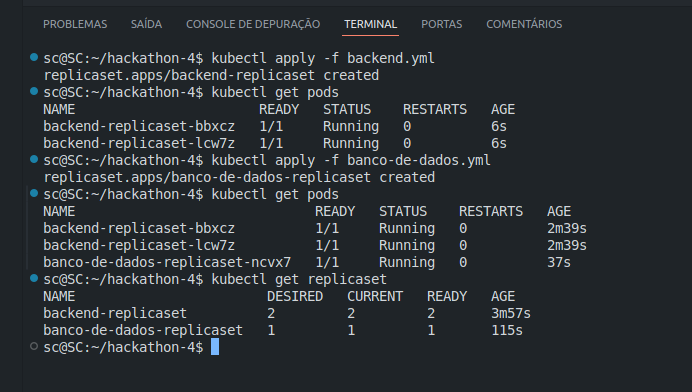
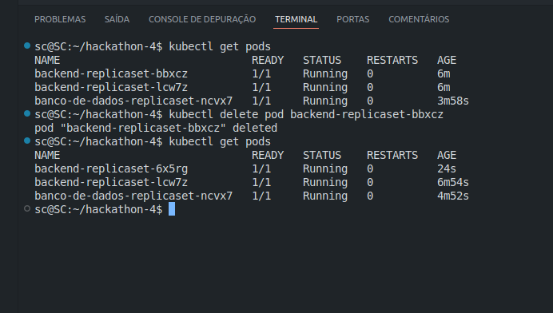

# Projeto Kubernetes - IT Talent

## Objetivos Específicos

### Kubernetes (Orquestração de Containers)

- Criar um ReplicaSet com 1 instância do Banco de Dados e 2 do backend, utilizando:
  - Projeto de Banco de Dados: [moisesAlc/Banco-IT_Talent](https://github.com/moisesAlc/Banco-IT_Talent)
  - Projeto de Backend: [moisesAlc/Backend-IT_Talent](https://github.com/moisesAlc/Backend-IT_Talent)
  
- Criar um repositório no GitHub com os arquivos `.yaml` necessários para o ReplicaSet.
  
- Adicionar imagens no repositório para demonstrar:

  - Execução do ReplicaSet.
   

  - Exclusão de um dos pods do ReplicaSet e subida de um novo pod para normalização automática pelo Kubernetes.

  
  

## Ferramentas Utilizadas:

-  **Kubernetes**: Orquestração de containers.
-  **GitHub**: Controle de versão e colaboração.
-  **Docker**: Contêineres para desenvolvimento e implantação.
-  **Visual Studio Code**: IDE para desenvolvimento.
-  **Markdown**: Formato de arquivo para documentação.

## Aluna:

